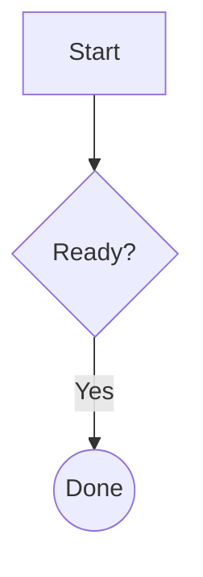

# Feature Fixture

> [!NOTE]
> Alert rendering with **formatted content**.

| Feature | Status |
|:--|--:|
| Tables | Working |
| Links | [OpenAI](https://openai.com) |

Inline ==highlight==, H~2~O, x^2^, and ~~removed~~ text.

<ruby>漢<rt>かん</rt></ruby>

```python
def greet(name):
    # Syntax colors
    return f"Hello, {name}"
```



